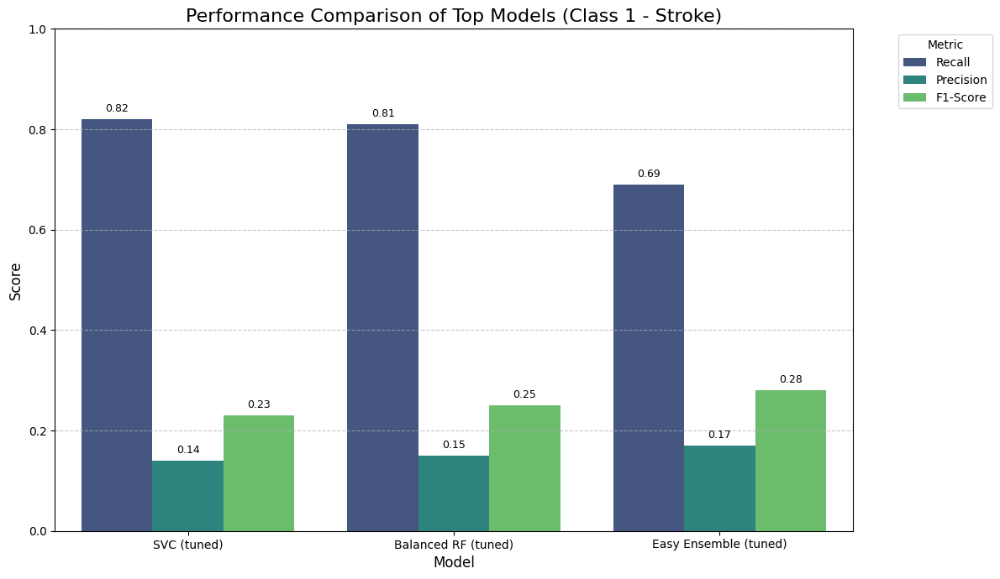
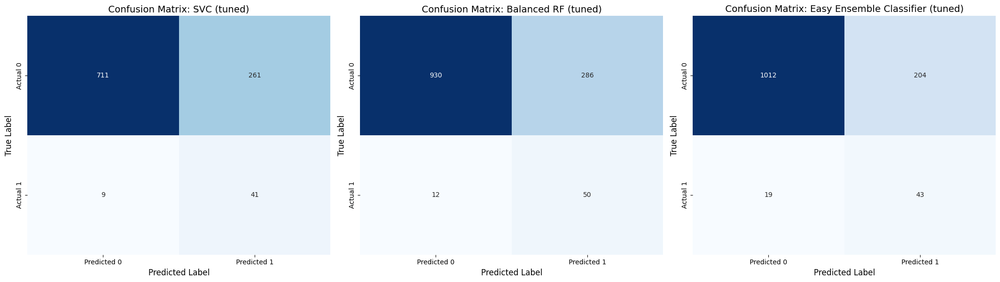
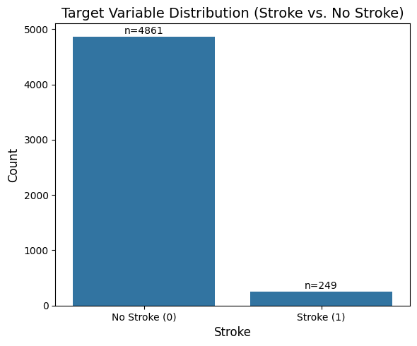

# 🧠 Machine Learning for Stroke Prevention: Identifying At-Risk Individuals for Early Intervention


---

## 🚀 Project Highlights (TL;DR)

- 🧠 Developed a stroke prediction model using real healthcare data.
- ⚠️ Tackled severe class imbalance (~5% stroke cases) with SMOTE & ensemble methods.
- 🎯 Focused on **recall** to reduce false negatives (missed stroke cases).
- 🧪 Compared 7+ models including SVC, Random Forest, XGBoost, and Easy Ensemble.
- 📊 Used visual tools (bar charts, confusion matrices) for performance evaluation.
- ✅ Skills: EDA, imbalanced classification, model tuning, metric analysis, interpretability.

---

## 📊 Objective

The primary goal of this project was to develop a robust machine learning model to predict the likelihood of an individual experiencing a stroke.  
Given the critical nature of stroke detection, the project emphasizes **maximizing recall** to **minimize false negatives**—ensuring that at-risk individuals are not missed by the system.

---

## 🛠️ Methodology

The project follows an end-to-end machine learning workflow:

1. **Exploratory Data Analysis (EDA):**  
   Distribution plots, correlation analysis, and class imbalance visualization.
2. **Data Preprocessing:**  
   Handled missing values, encoded categorical variables, and scaled numerical features.
3. **Baseline Modeling:**  
   Logistic Regression, Random Forest, KNN, and SVC on the imbalanced dataset.
4. **Class Imbalance Handling:**  
   - Oversampling: SMOTE, SMOTEENN, SMOTETomek  
   - Undersampling: manual downsampling  
   - Specialized models: BalancedRandomForest, EasyEnsembleClassifier
5. **Model Training & Evaluation:**  
   Precision, Recall, F1-score, ROC-AUC, Confusion Matrix.
6. **Hyperparameter Tuning:**  
   GridSearchCV for SVC, Random Forest, Easy Ensemble, etc.
7. **Final Model Comparison:**  
   Performance visualizations + detailed trade-off analysis between false negatives and other metrics.

---

## 📈 Results Summary

### 🔍 Performance Comparison



### 🧮 Confusion Matrices of Top Models



### 📋 Model Performance Summary

| Model                    | Accuracy | Precision | Recall | F1-score | TP  | FN  | Comment                                                                 |
|--------------------------|----------|-----------|--------|----------|-----|-----|-------------------------------------------------------------------------|
| **SVC (tuned)**          | 0.740    | 0.14      | **0.82** | 0.23     | 41  | **9** | Best recall (lowest FN), ideal for sensitive applications              |
| **Balanced RF (tuned)**  | 0.770    | 0.15      | 0.81   | 0.25     | **50** | 12  | Most TPs overall, robust choice                                        |
| **Easy Ensemble (tuned)**| 0.830    | **0.17**  | 0.69   | **0.28** | 43  | 19  | Best balance F1-wise, but higher FN                                    |

---

## 🎯 Final Decision

Given the focus on minimizing false negatives in stroke prediction:

- ✅ **SVC (tuned)** is the top choice for maximizing recall (0.82) with the **fewest false negatives (9)**.
- ✅ **Balanced Random Forest** identifies the **most stroke cases overall (TP = 50)**, offering strong generalizability.
- ⚠️ **Easy Ensemble** performs well in precision and F1, but has higher FN unless threshold is manually tuned.

> In real-world medical applications, choosing between these depends on acceptable trade-offs between recall, false positives, and clinical burden.

---

## ⚠️ Limitations

- Severe class imbalance requires careful handling to avoid biased models.
- Dataset is limited in size and lacks richer clinical/temporal features.
- Some models (e.g., KNN, vanilla RF) were ineffective without rebalancing.
- High-recall configurations (e.g., threshold 0.25) lead to high false positive rates, which may not be practical in healthcare systems.

---

## 🔮 Next Steps

- Add SHAP-based model interpretability to support explainable AI use cases.
- Deploy via Streamlit for interactive risk prediction.
- Evaluate performance on external datasets to ensure robustness.
- Explore time-series health record integration for longitudinal risk modeling.

---

## 📚 Skills Demonstrated

- 🧹 **Data Cleaning & Preprocessing**
- 📊 **EDA & Visualization** (matplotlib, seaborn)
- ⚖️ **Handling Imbalanced Datasets** (SMOTE, ensemble methods)
- 🤖 **Modeling** (LogReg, RF, KNN, SVC, MLP, XGBoost, Ensemble)
- 🧪 **Model Evaluation** (recall, F1, confusion matrix, ROC-AUC)
- 🎯 **Hyperparameter Tuning** (GridSearchCV)
- 💬 **Data Storytelling** and clear metric-driven decision making

---

## 📁 Dataset

The dataset used in this project is the [Stroke Prediction Dataset](https://www.kaggle.com/datasets/fedesoriano/stroke-prediction-dataset) by fedesoriano on Kaggle.

It contains **11 clinical and demographic features** aimed at predicting whether a patient is likely to experience a stroke. The prediction is binary: `1` indicates a stroke event, `0` indicates no stroke.

### 🔍 Features Description

- `gender` – Gender of the patient (Male/Female/Other)  
- `age` – Age of the patient in years  
- `hypertension` – Whether the patient has hypertension (0 = No, 1 = Yes)  
- `heart_disease` – Whether the patient has any heart disease (0 = No, 1 = Yes)  
- `ever_married` – Marital status  
- `work_type` – Type of employment  
- `Residence_type` – Type of residence (Urban/Rural)  
- `avg_glucose_level` – Average glucose level in blood  
- `bmi` – Body Mass Index  
- `smoking_status` – Smoking habits (never smoked, formerly smoked, smokes, Unknown)  
- `stroke` – **Target variable** (0 = No Stroke, 1 = Stroke)

### 📌 Key Characteristics

- The dataset simulates a clinical scenario for early **stroke risk prediction** based on accessible health indicators.
- It is **highly imbalanced**: stroke cases make up only about **5%** of the total observations, making recall-focused models and resampling techniques essential.
- Some features contain **missing values** (e.g., `bmi`, `smoking_status`) requiring proper preprocessing.

### 📉 Target Variable Distribution



This severe class imbalance highlights the need for techniques like **SMOTE**, **undersampling**, and **cost-sensitive learning** to improve model performance, especially in reducing **false negatives**.

---

## 🧪 How to Run

1. **Clone this repository:**
   ```bash
   git clone https://github.com/AlessandroConte/stroke-prediction.git
   cd stroke-prediction
   ```

2. **(Optional) Create a virtual environment:**

   ```bash
   python -m venv stroke_env
   source stroke_env/bin/activate  # On Windows: stroke_env\Scripts\activate
   ```

3. **Install dependencies:**

   ```bash
   pip install -r requirements.txt
   ```

4. **Launch the notebook:**

   ```bash
   jupyter notebook
   ```

---

## 📌 Notes

This is a **portfolio project**. It is not intended for clinical use and should not be used for real-world medical decision-making.

---

## 📧 Contact

**Alessandro Conte**
[LinkedIn](https://www.linkedin.com/in/alessandro-conte-ds)
[GitHub](https://github.com/AlessandroConte)

---

## 📄 License

This project is licensed under the MIT License – see the [LICENSE](LICENSE) file for details.

---

